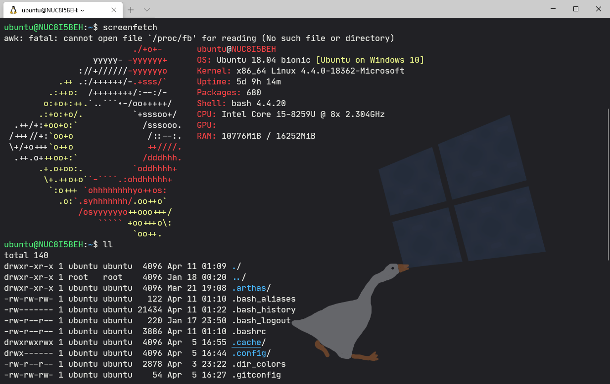
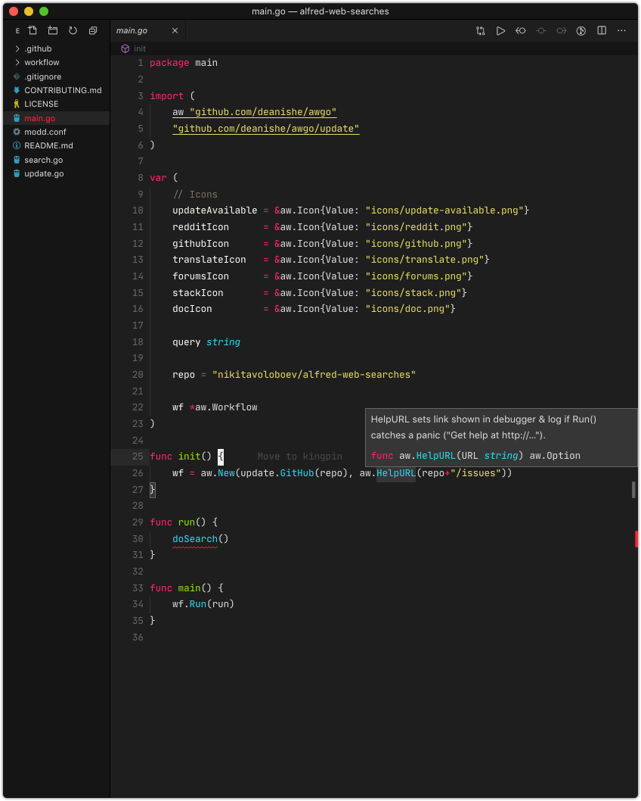
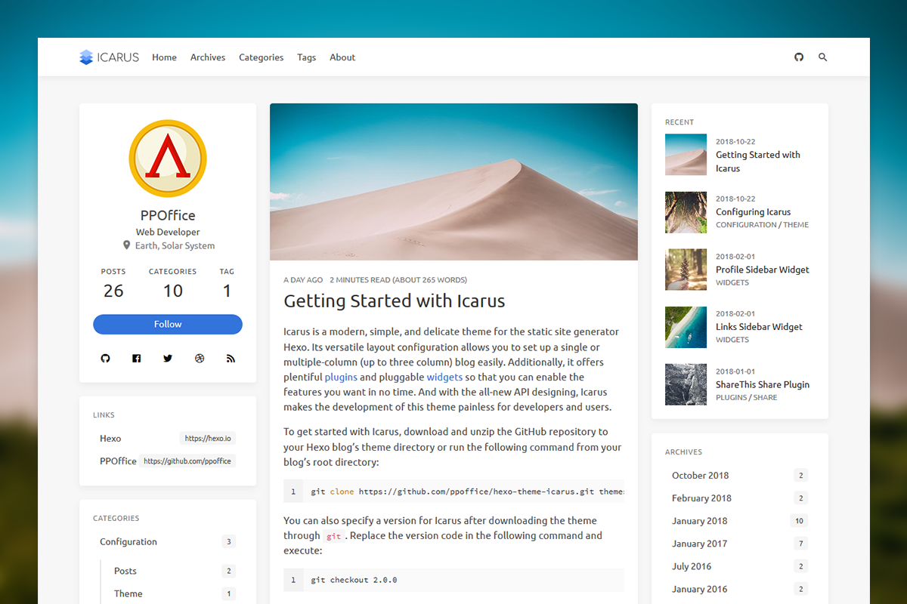

# my-tools

## Code

### Windows Terminal



- color scheme: [Snazzy]( https://github.com/mbadolato/iTerm2-Color-Schemes/blob/master/windowsterminal/Snazzy.json)
- background image: [Untitled Goose Wallpaper](https://wallpaperhub.app/wallpapers/6277)
- dircolors: [nord-dircolors](https://github.com/arcticicestudio/nord-dircolors)

```json
        {
            "guid": "{2c4de345-38b8-51cf-b941-2309a097f618}",
            "hidden": false,
            "name": "Ubuntu",
            "source": "Windows.Terminal.Wsl",
            "colorScheme": "Snazzy",
            "fontFace": "JetBrains Mono",
            "backgroundImage": "C:\\Users\\yhkang\\OneDrive\\图片\\goose.png",
            "backgroundImageOpacity": 0.6
        },
```


### VS Code



- VS Code [Monokai Night](https://github.com/fabiospampinato/vscode-monokai-night#readme) theme
-  [JetBrains Mono](https://www.jetbrains.com/lp/mono/) font
- [Remote Development](https://marketplace.visualstudio.com/items?itemName=ms-vscode-remote.vscode-remote-extensionpack) extension
- [IntelliJ IDEA Keybindings](https://marketplace.visualstudio.com/items?itemName=k--kato.intellij-idea-keybindings) extension

### Sublime Text

## Command Line Apps

- [tldr](https://github.com/tldr-pages/tldr) - Simplified and community-driven man pages.
- [httpie](https://github.com/jakubroztocil/httpie) - HTTP client.
- [screenfetch](https://github.com/KittyKatt/screenFetch) - Fetches system/theme information in terminal.

- alias

```bash
alias cdtmp='cd $(mktemp -d /tmp/tmp-XXXXXX)'
alias setproxy='export ALL_PROXY=http://127.0.0.1:1080'
alias unsetproxy='unset ALL_PROXY'
alias myip='curl myip.ipip.net'
```


## Password

### Bitwarden


## Blog

### Hexo



- theme [icarus](https://github.com/ppoffice/hexo-theme-icarus)
- use Github Action to automatic generate and deploy blog: [HexoCI](https://gist.github.com/yhkang/302736e8c73d4d9b5d5b30260b268770)

## Related

- https://github.com/nikitavoloboev/my-mac-os